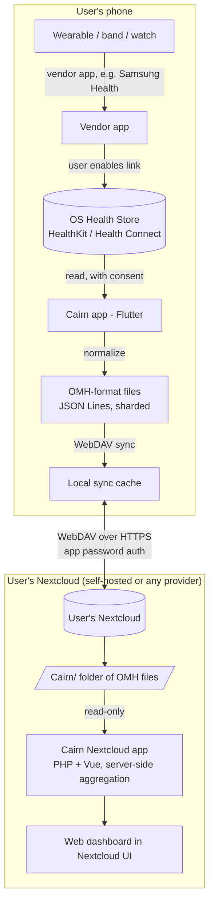

# Cairn — Design Document

> **Cairn** — a personal health-data aggregator. Your wearable and phone health data, pulled from the platform's own health store, written as plain open-format files, and synced into a Nextcloud *you* own. No vendor lock-in, no central server, no proprietary database.

---

## 1. Vision & Problem Statement

The wearable market is a set of walled gardens. Each vendor funnels your data through its own app and cloud; moving to a different health app is painful, and moving between Apple and Android is worse. Your history is effectively hostage to whichever ecosystem you started in.

Cairn inverts this. It treats **the user's own Nextcloud as the single, independent home** for their health data, and writes that data in an **open, documented file format** so it remains readable and portable forever — by Cairn, by a Nextcloud web view, or by anything the user writes themselves a decade from now. The anti-lock-in property is only real if the format is open; that constraint is non-negotiable.

Cairn is deliberately aimed at a **niche**: privacy-conscious people and self-hosters who already run (or will happily run) a Nextcloud. "Bring your own Nextcloud" is a feature for that audience, not a barrier. We are explicitly *not* trying to serve users who won't touch Nextcloud, because serving them would require us to become the central data custodian we are trying to eliminate.

---

## 2. Goals & Non-Goals

### Goals

- Aggregate health/fitness data from the platform-native health stores (Apple HealthKit, Android Health Connect).
- Persist that data as **plain files in the Open mHealth (OMH) / IEEE 1752.1 format** — no database as the system of record, no proprietary encoding.
- Sync those files to the user's **own Nextcloud**, with first-class, prominent onboarding for that connection.
- Provide an **optional, independent Nextcloud web app** that reads the synced files and offers a second frontend — fully disposable, never the source of truth.
- Keep the user the sole owner of their data; Cairn (the project/developer) holds nothing.

### Non-Goals (v1)

- **No central/shared server.** The "central place" is each user's own Nextcloud.
- **No cloud-vendor OAuth integrations** (Garmin/Fitbit/Oura/Whoop web APIs). These require a server-side OAuth holder, which re-centralizes the project. Deferred; see §11.
- **Not a medical device.** No diagnosis, treatment, or clinical claims. Aggregation and visualization only.
- **No writing back into HealthKit/Health Connect.** Cairn is a *reader* of the health stores. It does not push data into them.
- **No direct device/Bluetooth pairing.** Cairn relies on the OS health store, which vendor apps already populate.

---

## 3. Architecture Overview



**Two frontends, one source of truth.** The OMH files in Nextcloud are authoritative. The Flutter app and the Nextcloud web app are both *readers* (the Flutter app is also the *writer*). Either can be deleted without losing data.

---

## 4. Component: Mobile App (Flutter)

### 4.1 Framework & health integration

- **Flutter** (single codebase, iOS + Android).
- Health-store access via the **`health` package** (`pub.dev/packages/health`) — a single wrapper over Apple HealthKit and Google Health Connect. (Alternative to evaluate: `health_connector`, which advertises a larger typed surface and incremental sync.) Google Fit is dead — do not target it.
- The app reads from the OS health store only. It does **not** pair devices or talk Bluetooth.

### 4.2 Permissions & consent

- Request only the data types Cairn actually maps. Health-store policy and good practice both require granular, justified requests.
- **Handle partial grants gracefully.** Users can grant steps but deny heart rate. The app must degrade per-type without crashing or nagging.
- **iOS quirk:** HealthKit deliberately **hides read-authorization status** — you cannot reliably query whether read permission was granted; it returns "unknown." Design the UI around *data presence*, not a permission boolean. Never block the app waiting on a read-permission check that can't succeed.
- **Android:** Health Connect permissions are revocable at any time in system settings; re-check before each sync and handle revocation.

### 4.3 Reading, dedup, and incremental sync

- **Provenance:** every reading carries a source (phone vs watch vs vendor app). Record it in the OMH `acquisition_provenance` block.
- **Deduplication:** the same metric (e.g. steps) often arrives from multiple sources and double-counts. Apply a **source-priority policy per data type** (configurable; sensible defaults, e.g. prefer the wearable for heart rate). Dedup key: `(type, time-window, value, source)`.
- **Correction resolution (read path):** an in-place edit in the source health app — the common case is a re-typed manual weight — is re-read within the trailing reconcile window and **appended** as a new datapoint; append-only forbids rewriting the original, so both versions coexist on disk. Readers resolve this with **last-ingested-wins**: among datapoints that share the same source *and* effective instant, the one with the latest `header.creation_date_time` is shown and the rest are shadowed (kept as an audit trail). This covers *value* corrections at an unchanged timestamp; edits that move the timestamp, and deletions, are not resolvable this way and wait on the change-token work below. **This is a property of the file format's read semantics, so every reader must apply it identically** — the mobile dashboard (path A) and the Nextcloud app (path B) alike — or the two frontends will disagree on the same files.
- **Incremental sync:** with the `health` package this is **timestamp-window based** — track "last synced instant" per data type and query `[lastSync, now]`. Known limitation: this can miss *late-arriving or edited* historical records. For robust change tracking, the native APIs offer **Health Connect change tokens** and **HealthKit anchored object queries (`HKAnchoredObjectQuery`)**; reaching them requires a platform channel / native plugin. Decision: ship timestamp-window sync in v1, flag change-token sync as a v2 hardening task.

### 4.4 Background sync

- Health data is generated while the app is closed; periodic background sync is expected behaviour for this category.
- iOS: `BGAppRefreshTask` / HealthKit background delivery (`HKObserverQuery` + `enableBackgroundDelivery`). iOS background scheduling is best-effort and throttled.
- Android: `WorkManager` periodic work; respect Doze/battery constraints. Health Connect background reads have their own permission.
- Treat background sync as opportunistic; guarantee correctness with a manual "Sync now" and a foreground sync on app open.

---

## 5. Component: Data Format (OMH / IEEE 1752.1)

### 5.1 Why OMH

OMH is purpose-built for mobile/wearable measures, compact, and human-readable — the right *working* format for files the user owns. Its core schemas (sleep, physical activity, metadata) are standardized as **IEEE 1752.1-2021**. FHIR is the heavier clinical standard; we keep it as an **export option** via an OMH→FHIR mapping, not as the on-disk format. (See the conversation rationale: ergonomic internally, FHIR available at the boundary if a clinical handoff is ever needed.)

### 5.2 Data point structure

Each datapoint is an OMH-style object with a **header** and a **body**. Illustrative shape (validate against the actual OMH schema library / IEEE 1752.1 before finalizing — do not treat the field names below as authoritative):

```json
{
  "header": {
    "id": "uuid-v4",
    "creation_date_time": "2026-06-14T08:31:00+02:00",
    "schema_id": { "namespace": "omh", "name": "heart-rate", "version": "2.0" },
    "acquisition_provenance": {
      "source_name": "Samsung Health (Galaxy Fit3)",
      "modality": "sensed"
    }
  },
  "body": {
    "heart_rate": { "value": 62, "unit": "beats/min" },
    "effective_time_frame": { "date_time": "2026-06-14T08:30:55+02:00" }
  }
}
```

- Target measures for v1: **heart rate, step count, sleep (episode/duration), physical activity, body weight**. Add more as mappings are validated.
- **Units come from the schema definitions** — adhere exactly (e.g. `beats/min`, `kg`, step `count`). No ad-hoc units.
- Where a metric has no standardized OMH/1752.1 schema yet, define a clearly-namespaced custom schema (`namespace: "cairn"`) rather than bending an existing one — and document it.

### 5.3 File layout (conflict-aware)

Use **JSON Lines** (`.jsonl`, one OMH datapoint per line) so writes are *appends*, never rewrites of a growing array. Shard **one file per metric per day**:

```
/Cairn/
  manifest.json                      # format version, device list, last-sync anchors per type
  heart-rate/2026/2026-06-14.jsonl
  steps/2026/2026-06-14.jsonl
  sleep/2026/2026-06-14.jsonl
  weight/2026/2026-06-14.jsonl
  activity/2026/2026-06-14.jsonl
```

Rationale: append-only + per-day sharding minimizes the chance of two devices rewriting the same file, which is what triggers Nextcloud's `(conflicted copy)` behaviour. It also makes date-range queries trivial for the Nextcloud app.

### 5.4 Format versioning

- `manifest.json` carries a `format_version`. Bump it on any breaking layout/schema change and ship a migration. **The on-disk format is the one genuinely expensive thing to change** (it's every user's whole history), so treat changes with care.

---

## 6. Component: Nextcloud Sync

- **Protocol:** WebDAV over HTTPS to `https://<host>/remote.php/dav/files/<username>/Cairn/`.
- **Auth:** never the user's main password. Use Nextcloud **Login Flow v2** to obtain an **app password / app token**, stored in the OS secure storage (Keychain / Android Keystore). Tokens are individually revocable from the user's Nextcloud security settings.
- **Onboarding:** the Nextcloud connection is a **first-class, prominent step** — a guided "Connect your Nextcloud" flow (host URL → Login Flow v2 in a webview → confirm). Surface connection health (last successful sync, errors) prominently.
- **Sync engine:** local cache mirrors the `/Cairn/` tree; push new/append-only files; pull on the read path. Last-write-wins is acceptable given append-only sharding; detect and surface (rare) conflict copies rather than silently merging.
- **Offline-first:** the app works fully offline against the local cache; sync is a background reconciliation.

---

## 7. Component: Nextcloud App (server-side frontend)

- **Optional and independent.** Pure read-only consumer of the `/Cairn/` files. Never writes, never authoritative.
- **Stack:** classic Nextcloud app — **PHP + Vue** — installed from the Nextcloud app store onto the user's instance.
- **Why this over a standalone SPA:** it's **same-origin** (no CORS dance against Nextcloud's WebDAV), reuses the existing Nextcloud session (no token handling), and can **aggregate server-side** — the real answer to "you can't query a folder of JSON," e.g. roll up HRV-by-quarter in PHP and render a page.
- **Cost (accepted):** requires admin install rights and must be **version-tracked against Nextcloud major releases** or it gets disabled on upgrade. This maintenance tax falls on exactly the self-hoster audience least bothered by it.
- **Naming:** distinct from the existing generic "Health" Nextcloud app. Ship under the Cairn identity.

---

## 8. Data Source Chain & Device Support

**Key principle (confirmed):** Cairn reads the OS health store; it does not integrate devices one-by-one. But "device paired" ≠ "data in the health store." The real chain, e.g. for a Samsung Galaxy Fit3 (SM-R390) on a non-Samsung Android phone:

```
Galaxy Fit3 → Samsung Health app (phone) → [user links Samsung Health ⇄ Health Connect + grants consents] → Health Connect → Cairn
```

Constraints to design onboarding around:
- The **vendor app → Health Connect link is a required, manual step**, not automatic from pairing. (Samsung specifically: enable the Health Connect link *and* the "processing of health & wellness data" consent; a phone restart is sometimes needed before data flows.)
- **Health Connect does not run on Wear OS.** Watch data is relayed via the phone's vendor app; watch→phone timing follows the vendor's battery policy, so expect latency.
- **Data completeness is capped by the vendor app's export.** Cairn can only see what the vendor app writes to the health store. Encourage users to enable all relevant permission sub-categories.
- **The OS divide is real:** Health Connect (Android) and Apple Health (iOS) do not talk to each other. Cairn-via-Nextcloud *is* the cross-OS bridge — which is the whole point.

**Fallback for uncooperative devices (power-user, optional, documented):** **Gadgetbridge** can pair many bands without a vendor app/account and, as of recent versions, **writes to Health Connect** (data stays on-device). For users whose vendor app won't export, `device → Gadgetbridge → Health Connect → Cairn` is a viable path. Not a v1 dependency; document as an advanced option.

---

## 9. Data Flow Summary

**Write path (mobile):** OS health store → `health` package read (windowed/incremental) → dedup by source priority → map to OMH datapoint → append to `/Cairn/<metric>/<year>/<date>.jsonl` (local) → WebDAV sync to Nextcloud.

**Read/display path A (mobile):** local OMH cache → parse → in-app dashboard.

**Read/display path B (web):** Nextcloud app reads `/Cairn/` files server-side → applies the §4.3 last-ingested-wins correction resolution → aggregates → renders in Nextcloud UI.

---

## 10. Privacy, Ownership & Compliance

### 10.1 Principles

- The user owns and hosts the data; Cairn (project) stores nothing centrally.
- Minimal permissions, explicit consent, transparent data use.
- All transport over HTTPS; secrets in OS secure storage.

### 10.2 Backup caveat (must surface in-app)

The user's **long-tail history lives only in their Nextcloud.** Recent data still exists on-device and in the vendor cloud (within their retention windows), but older history does not. Show a gentle, non-blocking nudge: *"Your history lives in your Nextcloud — make sure it's backed up."* Do not assume a backup exists.

### 10.3 App store / distribution reality

- **Apple:** privacy policy required; clearly surface HealthKit use in-UI; HealthKit data may not be used for advertising/data-mining (only health management); **Apple Health data may not be stored in iCloud** (the user's own Nextcloud is fine — it's Apple's cloud that's barred). Avoid any medical-device framing.
- **Google Play:** complete the **Health apps declaration** + **Data safety** section; privacy policy on a public, non-geofenced URL; prominent disclosure + affirmative consent. **Policy tension:** Play prohibits using health-permission data with apps that *sync between incompatible devices/platforms*, and prohibits headless access — Cairn's cross-platform-funnel framing sits awkwardly with this.
- **Distribution decision:** the strict, no-compromise version is cleanest shipped via **F-Droid / sideload** (and the iOS build for personal/community use), which also sidesteps most of the Play health-policy friction. A Play/App Store release is possible but requires careful scoping of the store listing and data-use declarations. Decide per channel. Step-by-step per-channel instructions: [`RELEASE.md`](RELEASE.md).
- Cairn is **not** a regulated medical device and must avoid diagnostic/treatment claims to stay out of that review path.

---

## 11. Roadmap

**v1 — Core loop (Android-first, iOS in parallel via Flutter):**
- `health` package integration (HC + HealthKit), permissions + partial-grant handling.
- OMH mapping for HR, steps, sleep, activity, weight.
- JSONL sharded file writer + manifest.
- Nextcloud Login Flow v2 + WebDAV sync + prominent onboarding.
- In-app dashboard (read from local OMH cache).
- Backup nudge; data-source onboarding (vendor → Health Connect guidance).

**v1.5 — Nextcloud app:**
- PHP + Vue read-only app with server-side aggregation and basic charts.

**v2 — Hardening & reach:**
- Change-token / anchored-query incremental sync (native plugin).
- OMH→FHIR export at the boundary.
- Gadgetbridge fallback documentation/integration.
- Optional cloud-vendor pulls **only** via a user-self-hosted, stateless pull-and-forward relay (never a shared server).

---

## 12. Tech Stack

| Layer | Choice |
|---|---|
| Mobile app | Flutter (Dart), iOS + Android |
| Health access | `health` package (HealthKit + Health Connect); evaluate `health_connector` |
| On-disk format | Open mHealth / IEEE 1752.1, JSON Lines, sharded files |
| Sync | WebDAV (Nextcloud), Login Flow v2 app tokens |
| Secure storage | iOS Keychain / Android Keystore |
| Background | `BGAppRefreshTask` + HealthKit background delivery (iOS); `WorkManager` (Android) |
| Nextcloud app | PHP + Vue (classic Nextcloud app), read-only |
| Export (later) | FHIR R4 via OMH→FHIR mapping |

---

## 13. Engineering Standards

- **Zero analyzer warnings.** `flutter analyze` and `dart analyze` must be clean; treat lints as errors in CI. Enforce `dart format`. Adopt a strict `analysis_options.yaml` (e.g. `flutter_lints`/`very_good_analysis`).
- Immutable models; clear separation of concerns (suggested: Riverpod or BLoC for state, isolates for heavy JSON parsing).
- Clean, independently-testable interfaces around every native capability (health access, secure storage, WebDAV) so they can be mocked and verified in isolation.
- Validate emitted OMH against the schema library in tests — the format is the product's durability guarantee.
- **Internationalization.** All user-facing text goes through Flutter `gen-l10n` ARB files (`lib/l10n/`, English template + German); no hardcoded display strings (unit symbols and ISO dates excepted). The app follows the device locale with an in-app override persisted device-locally (never synced). Numbers/durations are `intl`-formatted per locale; an ARB-parity test guards against missing translations.

---

## 14. Open Questions / Risks

- **Vendor-app export completeness/latency** (esp. Samsung Health → Health Connect): partly outside Cairn's control; mitigate with onboarding guidance and clear "last synced" UI.
- **`health` package incremental-sync fidelity:** windowed reads may miss edited/late records; plan the v2 change-token path.
- **Background sync reliability** on aggressively battery-managing OEMs (common on Android).
- **Nextcloud app version-tracking** maintenance burden across NC major releases.
- **Sync conflicts** if a user runs Cairn on two phones writing the same day's metric — append-only sharding reduces but doesn't fully eliminate; define conflict-copy detection/merge.
- **Store-policy posture** for any Play/App Store release vs. the F-Droid/sideload strict build.

---

## 15. Development Plan & Phases

This expands the high-level roadmap (§11) into sequenced, verifiable phases.
Each phase lists its **goal**, the `lib/src` layers it builds on, and an
**exit criterion** — the observable bar that says it is done. Phases are ordered
so the **format-affecting work (OMH schema + file layout) is stabilized early**,
because the on-disk format is the one genuinely expensive thing to change
(§5.4). Phases 1–6 constitute v1; Phase 7 is v1.5; Phase 8 is v2.

> Status legend: ✅ done · 🚧 in progress · 🔭 next · ⬜ planned.

### Phase 0 — Foundation ✅

- **Goal:** a buildable, lint-clean skeleton with the architecture seams in
  place.
- **Scope:** Flutter scaffold (Android + iOS), strict `analysis_options.yaml`
  gate, MIT licensing + AGPL boundary documented, abstract boundary interfaces
  for `health` / `omh` / `storage` / `sync`, baseline docs (this file,
  `DEVELOPMENT.md`, `CHANGELOG.md`).
- **Exit:** `dart analyze` clean, widget smoke test green, app runs.

### Phase 1 — Health read + OMH mapping ✅

- **Goal:** read the five v1 measures and emit schema-valid OMH datapoints,
  fully offline (no sync yet).
- **Layers:** `health/` (implement `HealthRepository` over the `health`
  package; permission requests; partial-grant + iOS data-presence handling —
  §4.2), `omh/` (datapoint models + `OmhMapper` for HR, steps, sleep, activity,
  weight; source-priority dedup — §4.3).
- **Exit:** each metric reads on a real device; emitted datapoints validate
  against the OMH / IEEE 1752.1 schema library in tests (§13).

### Phase 2 — Local persistence (sharded JSONL + manifest) ✅

- **Goal:** durable, append-only local cache in the documented file layout.
- **Layers:** `storage/` (implement `OmhFileStore`: one append-only `.jsonl`
  per metric per day; `manifest.json` with `format_version` + per-type
  last-sync anchors; date-range reads — §5.3–5.4). Heavy JSON parsing runs in
  isolates (§13).
- **Exit:** write/read round-trips are stable; manifest anchors drive the
  incremental read window; appends are crash-safe.

### Phase 3 — Nextcloud connection + sync ✅

- **Goal:** the core value loop — health data lands in the user's own Nextcloud.
- **Layers:** `sync/` (`NextcloudAuth` Login Flow v2 → `SecureTokenStore` app
  token in Keychain/Keystore; `NextcloudSyncTarget` WebDAV push over `http` +
  `xml`; last-write-wins + conflict-copy detection — §6) driven by a
  device-local, never-synced push journal. Prominent "Connect your Nextcloud"
  onboarding and a connection-health/"Sync now" surface.
- **Exit:** end-to-end write path device → `/Cairn/` on a real Nextcloud;
  offline-first cache reconciles (push) on reconnect; conflict copies are
  surfaced, not silently merged.
- **Done as:** push + conflict-detect. The host is `https`-pinned and the app
  password lives only in secure storage. The **bidirectional remote→local
  pull-merge** (multi-device convergence) and per-device anchor keying are
  deferred to the change-token / multi-device work in **Phase 8**.

### Phase 4 — In-app dashboard + onboarding ✅

- **Goal:** a usable read path and a guided first run.
- **Layers:** `query/` (read path A over the local OMH cache — §9),
  `sleep/`/`home/`/`settings/` screens (`fl_chart`), `profile/` (synced BMI
  profile); data-source onboarding (vendor → Health Connect guidance — §8) and
  the backup nudge (§10.2).
- **Exit:** first-run flow complete; dashboard reflects synced data.
- **Slice 1 ✅:** navigation shell + overview Home + rich sleep-stage deep-dive
  (hypnogram/stages/trend) + dynamic BMI from a synced `profile.json` + Settings
  (connection, manual sync, profile editor). Reads are timezone-correct and
  source-deduplicated; a shared revision signal reloads every screen on new data.
- **Slice 2 ✅ (partial):** OS-specific data-source **setup guide** (Android +
  iOS, §8), reachable from Settings and the Sleep empty state.
- **Slice 3 ✅:** **internationalization** (English + German via `gen-l10n`),
  device-locale default with an in-app language picker; locale-aware number and
  duration formatting (§13).
- **Slice 4 ✅:** per-category detail screens (weight / steps / heart rate /
  activity), reached by tap-through from Home, over new query-layer time-series
  methods; plus the backup nudge (§10.2). First-run guidance is the setup guide
  + the Settings connect flow (no separate wizard).

### Phase 5 — Background sync 🚧

- **Goal:** opportunistic sync while the app is closed, without trusting it for
  correctness.
- **Scope:** iOS `BGAppRefreshTask` + HealthKit background delivery; Android
  `WorkManager` + Health Connect background read; guaranteed manual "Sync now"
  and foreground sync on open (§4.4).
- **Exit:** background sync observed on both platforms; correctness holds even
  if it never fires.
- **Done:** the guaranteed paths — a real "Sync now" (full read + push) and an
  opportunistic foreground sync on open — plus the periodic background task
  (`workmanager`: Android `WorkManager` + iOS `BGAppRefreshTask`, ~6 h,
  network-required, battery-not-low), reusing the single foreground refresh
  cycle. Android declares `READ_HEALTH_DATA_IN_BACKGROUND`.
- **Pending:** on-device confirmation the task actually fires on each platform
  (scheduler + native config are wired but need a real build to observe);
  HealthKit push-style delivery (`HKObserverQuery`) remains a later option.

### Phase 6 — Release hardening (ship v1) 🚧

- **Goal:** a shippable, policy-correct build.
- **Scope:** privacy policy; HealthKit/Health-Connect declarations; permission
  audit; the strict **F-Droid / sideload** build as the primary channel, with
  Play/App Store listings scoped separately if pursued (§10.3).
- **Exit:** v1 installable on the chosen channel(s) with no medical-device
  framing.
- **Done:** [`docs/RELEASE.md`](RELEASE.md) — a step-by-step per-channel release
  guide (F-Droid official + self-hosted, sideload, Google Play, Apple App Store,
  Nextcloud App Store) plus the Nextcloud-major version-tracking routine; a
  published privacy policy ([`docs/PRIVACY.md`](PRIVACY.md), live at
  <https://luminaapps.com/cairn-privacy.html>); F-Droid packaging (listing
  metadata + feature graphic under `fastlane/metadata/android/` + the fdroiddata
  recipe `fdroid/com.luminaapps.cairn.yml`); and a tag-triggered CI workflow
  (`.forgejo/workflows/release.yml`) that builds + signs the APK and publishes
  it to both GitHub and Forgejo. App identity is `com.luminaapps.cairn`.
- **Remaining:** open the F-Droid RFP + fdroiddata MR (recipe + listing assets,
  incl. screenshots, are ready); complete the store declarations/build for any
  other channel(s) pursued.

### Phase 7 — Nextcloud web app (v1.5) ⬜

- **Goal:** an optional, read-only second frontend with server-side
  aggregation.
- **Scope:** read-only PHP + Vue app (§7) in its own subtree under
  **AGPL-3.0-or-later** (see `DEVELOPMENT.md` §5); roll-ups computed
  server-side; basic charts; version-tracked against Nextcloud majors.
- **Exit:** installs on a user Nextcloud, renders aggregates from `/Cairn/`,
  never writes.

### Phase 8 — Hardening & reach (v2) ⬜

- **Goal:** close the known fidelity gaps and extend reach without
  re-centralizing.
- **Scope:** change-token / `HKAnchoredObjectQuery` incremental sync via a
  native plugin (§4.3); OMH→FHIR export at the boundary (§5.1); Gadgetbridge
  fallback docs/integration (§8); optional cloud-vendor pulls **only** via a
  user-self-hosted, stateless relay (§11).
- **Exit:** late/edited records are captured reliably; no shared server is ever
  introduced.

---

*Source of truth: the OMH files in the user's Nextcloud. Everything else — the mobile app, the web app, future exports — is a replaceable reader on top of that. Keep the format open and the project never becomes the lock-in it set out to kill.*

